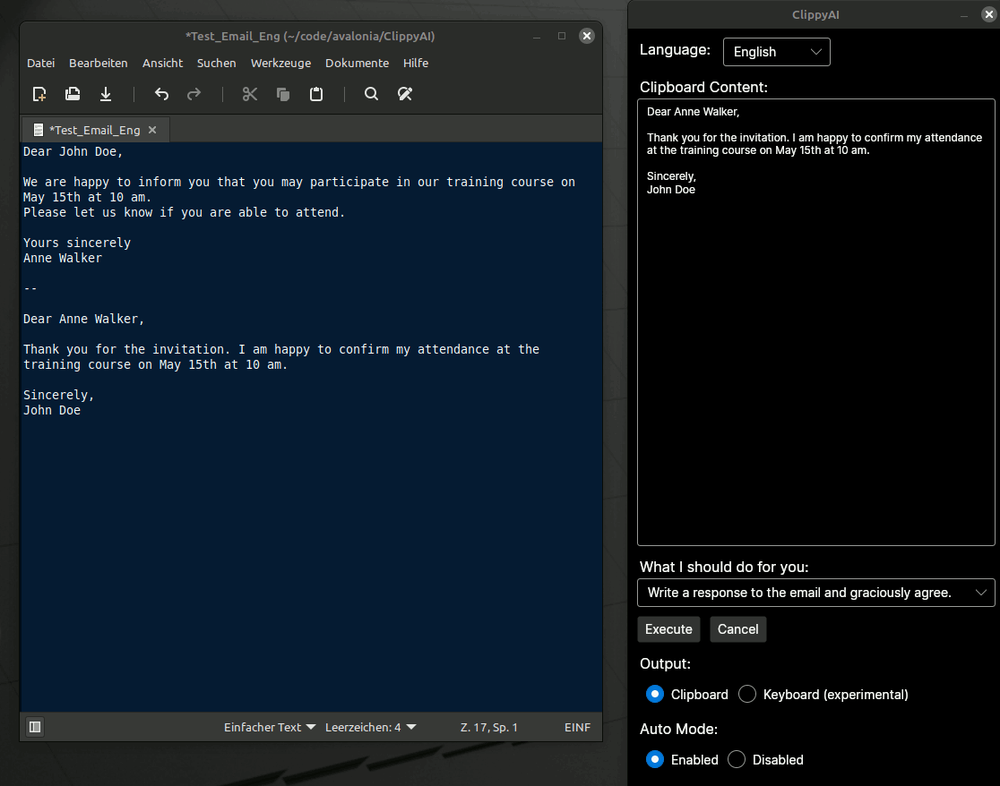

**ClippyAI**
================

**Overview**

ClippyAI is an innovative productivity tool that revolutionizes the way you interact with your computer. This
application takes notes from your clipboard and sends them along with a task to Ollama, a popular local AI service.
After processed, the response will be either available in the clipboard, or will automatically be typed in 
the application the user is running.

**Features**

* **Highest Level of Data Privacy**: Your data stays your data and nothing leaves your PC. After installation, you can
even use this tool completely offline.
* **Clipboard Integration**: ClippyAI seamlessly integrates with your system's clipboard, capturing text instantly
after it is copied or cut. Users can send the clipboard contents along with one of the predefined or a custom task
to the Ollama API.
* **Keyboard Simulation**: The response is either sent to an integrated output field or can automatically be typed
into the application window where the user is working. Alternatively, you can just send the output back to the clipboard.
* **Cross-Platform Support**: Developed with .NET and Avalonia, ClippyAI runs on Windows and Linux (X11)
ensuring that users can enjoy its benefits regardless of their platform.

**Example Use Cases**

* Copy an email and let ClippyAI write the response
* Copy some code from an IDE to find an error
* Explain a compilcated text in more easy words
* Translate text to another language

**Getting Started**

1. Install Ollama from https://ollama.com.
2. Run `ollama pull gemma2` on the command line to install the llama3 AI model on your PC.
3. Clone this repository and build and run this tool. You may need to build the project twice, if you are using VS Code, because it generates the necessary resources files during the first build.
5. Check the configuration in App.config. The standard values should work fine for most installations.
6. Run the application.

**Using ClippyAI**

1. To create a task, simply copy or cut some text from another application (e.g., email, chat, or document).
2. Choose the desired task type.
3. Click ''Send'' to send the task to the local Ollama API.
4. Review and edit your generated task as needed.

**Disclaimer**

This tool is in an early development phase. Use it at your own risk. We take no responsibility, if it accidently
deletes or overwrites your currently opened documents.
If you encounter any issues or have questions or new ideas about using ClippyAI, please open an issue here on GitHub.

**Future Plans**

**Developers Wanted!**

ClippyAI is an open-source project that relies on contributions from passionate developers like you. If you're
interested in joining the ClippyAI community and contributing to its development, here are some ways you can get
involved:

* **Bug Fixing**: Help me squash those pesky bugs that prevent users from enjoying the full potential of ClippyAI.
* **Feature Development**: There are several things in my mind on how to improve ClippyAI. Take a look at the issues page for open enhancements. You may also suggest new features or enhancements.
* **Testing**: Put ClippyAI through its paces and help me to identify areas where it can be improved.

To get started with contributing to ClippyAI, please submit your pull requests.

**Licensing & Terms**

ClippyAI is distributed under the terms of the [MIT License](/LICENSE.md). By using ClippyAI, you agree to abide by
the terms and conditions outlined in the license.

